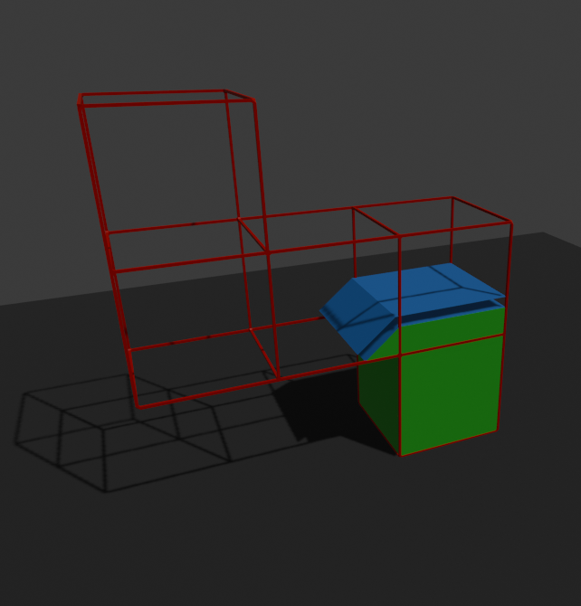

# Shockwave Slicer (generalized conical slicing)

3D printers extrude plastic to build objects, and current slicers (Eg Prusa, Cura) do
so via moving the toolhead in an X-Y horizontal plane called a "slice". These 2D
slices have some issues, namely shallow angles and overhangs. If you want to print a
shape like the letter "T" the ends of the top arm will droop as the printer is
extruding plastic over nothing but air. To combat this, most slicers allow you to
generate support material to hold these parts up.

There is another option that recently emerged called "conical slicig", whereby
the "slice" is no longer flat, but instead shaped like a cone. This means
that the part grows from the inside to the outside (on the vertical axis), 
meaning that printing is much less likely to happen completely unsupported. 

The question is how to implement this generically so that it can be done on any
3D model with overhangs in any direction. This repository holds the answer.

Here's a model with some 90 degree overhangs:

And here's a potential arrangement of layers that avoids needing any support
 material:

## Prior Work and Suggested Reading

#### Conical Slicing:
Michael Wüthrich, Maurus Gubser, Wilfried J. Elspass 1 and Christian Jaeger
(2021). [A Novel Slicing Strategy to Print Overhangs without Support Material](https://www.mdpi.com/2076-3417/11/18/8760)  
This is the first description of printing in cone shapes to avoid overhangs.

Rene K. Mueller (2021) [Slicer4RTN Blog](https://xyzdims.com/2021/02/26/3d-printing-conic-slicing-for-rotating-tilted-nozzle-rtn/)

#### Arachne Slicer:
Tim Kuipers, Eugeni L. Doubrovski, Jun Wu, Charlie C.L. Wang  (2020). [A Framework for Adaptive Width Control of Dense Contour-Parallel Toolpaths in Fused Deposition Modeling](https://www.sciencedirect.com/science/article/pii/S0010448520301007)  
Reading this paper is what prompted me to start thinking about this problem. I wondered if it's solution could be generatlized to 3 dimensions to generate variable layer heights. Yes you could generalize it, but you need a magical 6DOF printer and the print "bed" wouldn't exist.

#### Non Planar Surfaces
Daniel Ahlers (2018) [3D Printing of Nonplanar Layers for Smooth Surface Generation](https://tams.informatik.uni-hamburg.de/publications/2018/MSc_Daniel_Ahlers.pdf)

James Sherwood Page, Autodesk Inc (2015) [Systems and methods for improved 3D printing (US10005126B2)](https://patents.google.com/patent/US10005126B2/en)  
To the best of my knowledge, this work does not infringe on this patent as the generated tool paths do not conform to the object surface, but it does describe non-planar printing.

#### Other Thanks
Stefan Hermann, [CNC Kitchen](https://www.cnckitchen.com/)  
For communicating developments in the 3D printing space and putting them to the test in a scientifically rigorous manner. 

# How does this work?

1. Given a model to print (red) An already printed part (green) And the previosly printed layer (blue)  

2. Displace the previously printed layer by the layer height along it’s surface normals  

3. Minkowski Sum with a cone of your hotends “safe” angle. (ie extrude all loose edges down and at an angle. It's pretty much the same thing.)  

4. Clamp to model bounds and subtract already printed parts. The result is the volume that you have to fill with plastic  

5. Take the top surface. This is the "slice" that the tip of the extruder travels along.  

How well does it work? Here's the complete shape sliced:  

And even if there are overhangs on multiple axis it indeed does conical slices properly:  

# Current State
## 2024-04-20
- Can slice arbitrary models in python, as far as I can tell there will not be any geometry errors so long as the manifold library is correct in how it behaves (which is appears to be for my two test modesl)
- Quite slow due to issue #2

Things I want to do:
 - POC for 3D perimeter/toolpath generation as outlined in documents/anatomy_of_a_slicer.md

## 2024-04-18
- Demo made in blender geometry nodes to visualize proof of concept:
    - Seems to work OK. 
    - Has issues with really thin layers as it tries to get the top surface exactly in line with the model. 
        - And other sub-layer details. Any top surface becomes part of a print plane.
    - Some minor geometry issues in this implementation (blender geometry nodes)
    - Really slow due to lots of geometry boolean operations
    - Layer lines everywhere - on the top etc
    - The same layer can be at vastly different heights – possible collisions - particularly if multiple bed contact points and horizontal overhang 

- Patent search. Haven't found anything yet. US10005126B2 doesn't cover it as we aren't using the top surface of the model to influence extrusion amounts. 

- Things I want to do:
    - Do a complete MVP: take the output of these layers, generate perimeters/contours, generate G-code toolpath, print it.
    - Get it into current open source slicing software.
    - Technical TODO's if everything goes well:
        - Find a faster implementation. It feels like there is possibly a non-iterative approach using voroni to determine print “slice” normal? Or some sort of fluid wave-propagation stuff.?
        - Reconvergence at different layer heights if multiple points on print bed. Possibly look at the min-max height of the layers and use that to determine
        what parts need more material on this layer? I'll need to diagram this at some point.

# Why "Shockwave"?
I call it "shockwave" because when drawing diagrams to figure this out I noticed
how the layers look like wave propagation:  

It looks like someone has applied an impact to the bed and are modeling the way the
impact flows through the part to print!