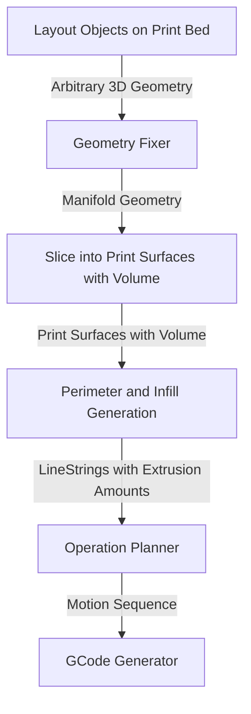

# Anatomy of a slicer
Shockwave intends to be a true 3D slicer, and to be modular enough to experiment
with different 3D slicing methodologies. As such it is useful to break it down
into several separable components, so they can be swapped out/replaced as needed.

In my mind the basic flow for a slicer is:



In my mind these steps apply regardless of if the slicer is planar, fully-3D, whatever. It probably even applies to CNC toolpath generation where the only difference is that the permieter generator generates perimeters on the outside.

To keep it as general as possible, things should be kept in 6DOF space the whole time. For example the linestring the perimeter generator emits should include the
approach normal of the tool.


## Datatypes
### Aribtrary 3D geometry
Whatever is easiest, probably some python type. It probably has a bunch of vertices,
and then describes a face as a set of 3 indices into the vertex array.

### Manifold Geometry
Manifold geometry is solid and has no "holes" in it that would allow you to see
the back side of the surface. Objects like torus' are manifold, but imagine if
you drilled a hole through a 3D print so you could see the infill, this is kinda what
being non-manifold is. 

The [manifold library](https://github.com/elalish/manifold/wiki/Manifold-Library#manifoldness) has a technical definitions:

> Every edge of every triangle must contain the same two vertices (by index) as exactly one other triangle edge, and the start and end vertices must switch places between these two edges. The triangle vertices must appear in counter-clockwise order when viewed from the outside of the manifold.

I don't think there are any nice datatypes to represent actually manifold geometry in such a way that non-manifold geometry is unrepresentable, so we'll probably
use manifolds Manifold type!


### Print Surfaces with Volumes
In a normal slicer, this is the "slice" and the volume is implied by multiplying the
area by the layer height. This is a simplification of saying "the print head moves along a surface, and extrudes plastic until it fills a volume. 

Even this is a simplification of "the print head moves along a line and extrudes plastic to fill a volume" but I have not yet dreamed up a way of going straight from a 3D model into a space filling curve in such a way that a normal 3 axis gantry printer can print it. Someone will probably invent a solution for this at some point, we're stuck with some sort of 'slices.'

The surface can be represented as a 3D mesh, and the volume as whatever is used
as a manifold.


### LineStrings with Exstrusion Amounts
This describes the path that the extruder head moves along, and how much plastic ie
extruded at each point. Because I want things to be generic, this is a 6DOF linestring - each point on the linestring is both an XYZ coordinate as well as an XYZ normal, which describes what angle the head should approach at. In the case of
a normal 3 axis gantry machine, the normal is always `(0,0,1)`, but belt printers
are fixed at `(0,0.71,0.71)`, and rotbots can support other normals.

This does mean that the generation of these linestrings must know about the machine
kinematics to determine if the machine can actuall reach them.

These linestrings are represented as an array of point arrays. Ie:
```
LinePoint(
    position: [float, float, float],
    normal: [float, float, flloat]
)

Loop(
    points: Array[LinePoint]
)

LineStrings(
    loops: Array[Loop]
)
```
sort of thing.


### Motion Sequence
You can think of this as a set of abstract instructions "move to this point, extrude some plastic, do a really big z-hop while moving to this other point." The idea
is that this can be translated into different flavours of GCode fairly easily. 

There isn't necessarily a 1:1 mapping of a motion sequence action into a GCode command.


### GCode
What it sounds like. [gcode](https://en.wikipedia.org/wiki/G-code). Probably
[marlin flavoured](https://marlinfw.org/meta/gcode/) at this stage as that is what my machine runs. 
